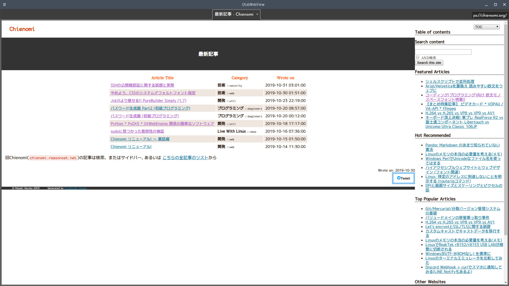

# qtabwebview

Simplest tab web browser with QWebEngineView.



# Dependency

* Python 3
* PyQt5
* Python QWebEngine

# Install

Put `qtabwebview.py` on your `$PATH`.

# Usage

```
qtabwebview.py <address>
```

You can choose profile name with `$qtwview_profile` environment variable.

# Keyboard Shortcuts

|Key|Action|
|-------|-----------------------|
|Ctrl+PgUp|Previous tab|
|Ctrl+PgDn|Next tab|
|Ctrl+W|Close tab|
|F5 / Ctrl+R|Reload page|
|Alt+←|Page back|
|Alt+→|Page forward|